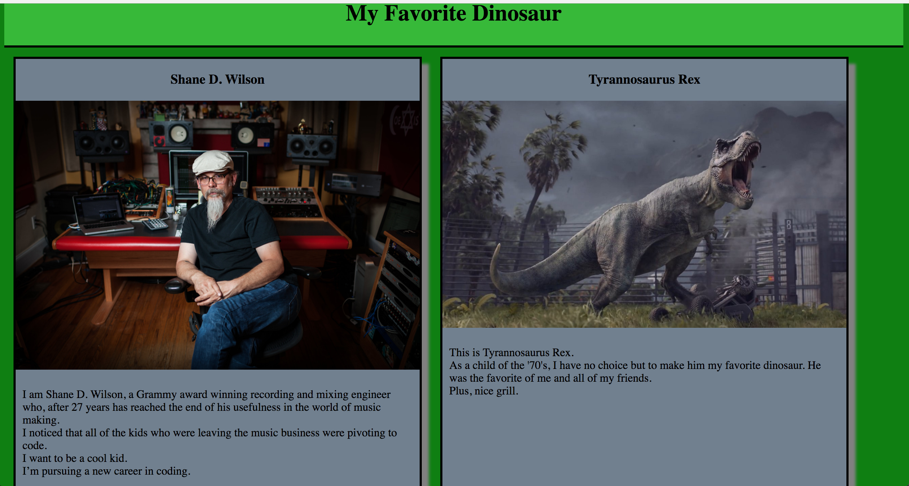

# Favorite Dinosaur

This was a mini-challenge with the following requirements:


1. Create a site for your favorite dinosaur. Write clean code - consistent spacing, appropriate tabbing, etc. Use git, git branches, and github. You should have a fresh branch for each of the following features:

  1. As a user, when I go to your site I should see your favorite color set to the background, and I should see a footer with your name and date.

  2. As a user, when I go to your site I should see a card with a picture of you and a paragraph about you, and this card should take up half the width of the screen

  3. As a user, when I go to your site I should see a card with a picture of your favorite type of dinosaur and a paragraph of why its your favorite dinosaur, and this card should take up half the width of the screen

 ## Screenshots

  

 ## How to run this project:

* Use nmp to install htpp-server:

```sh

npm install -g http-server

```
* Run the server:

```sh

hs -p 9999

```

* Open Chrome and navigate to:

```

localhost:9999

```